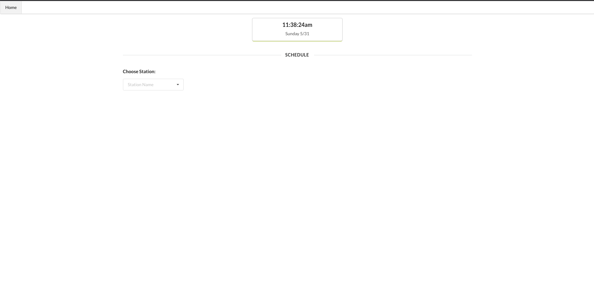

This git repo serves code, that would help users see MBTA schedule realtime. 
It uses MBTA API's to fetch realtime train metrics.
https://api-v3.mbta.com/docs/swagger/index.html

Front-end is in React and Backend is a Python Flask app that makes API calls to fetch data.

Reach out to me at harshavardhan217@gmail.com if you have any questions/ suggestions.
Look at below scripts to understand how to get this running on your local.

#### Homepage

#### Display Arrivals and Departures at Current Station

#### No Arrivals or Departures Today at the Station

## Available Scripts

In the project directory, you can run:

### `yarn start`

Runs the app in the development mode. 
Open [http://localhost:3000](http://localhost:3000) to view it in the browser.

The page will reload if you make edits. 
You will also see any lint errors in the console.

### `yarn start-api`

Runs the flask app, python backend will be able to respond to REST calls.
You neeed to run both `yarn start` and `yarn start-api` to ensure that both frontend and backend work off each other.

### `yarn test`

Launches the test runner in the interactive watch mode. 
See the section about [running tests](https://facebook.github.io/create-react-app/docs/running-tests) for more information.

### `yarn build`

Builds the app for production to the `build` folder. 
It correctly bundles React in production mode and optimizes the build for the best performance.

The build is minified and the filenames include the hashes. 
Your app is ready to be deployed!

See the section about [deployment](https://facebook.github.io/create-react-app/docs/deployment) for more information.

## Learn More

You can learn more in the [Create React App documentation](https://facebook.github.io/create-react-app/docs/getting-started).
